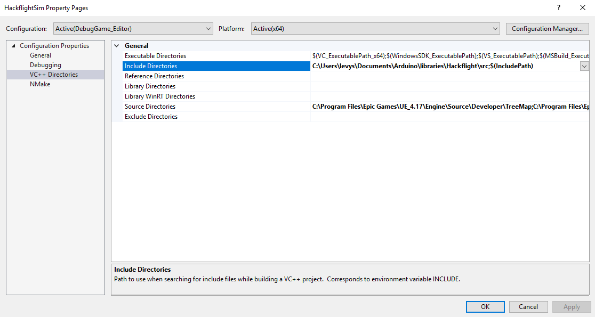

# About

HackflightSim is a simple quadcopter flight simulator using the C++ 
[Hackflight](https://github.com/simondlevy/Hackflight) firmware and Unreal
Engine 4.  

We began this project using the [V-REP
platform](https://github.com/simondlevy/Hackflight-VREP) but switched to
UnrealEngine after seeing the kinds of beautiful, real-time simulations that
Microsoft was able to get with its
[AirSim](https://github.com/Microsoft/AirSim) program. 

HackflightSim differs from AirSim in a few important ways:
* HackfightSim uses the same simple flight-control 
[firmware](https://github.com/simondlevy/Hackflight/tree/master/src) that we fly on our real-world 
[quadcopters](http://diydrones.com/profiles/blogs/flight-of-the-ladybug).
* HackflightSim is tiny, using under 500 lines of C++ code for the simulator component.
* HackflightSim is released under the GPL license, whereas AirSim uses the MIT license.
* HackflightSim is currently supported only on Windows, whereas AirSim can also be run on Linux.
* HackflightSim focuses exclusively on quadcopter firmware, whereas AirSim supports deep learning and
different kinds of vehicles.

# Prerequisites

## Hardware

We are developing HackflightSim under Windows 10 on an HP Z440 workstation with
32GB of RAM, a solid-state drive, and and NVIDIA GeForce GTX 1080 Ti graphics
card.  It may however be possible to develop on a less &ldquo;loaded&rdquo;
machine &ndash; see [here](https://docs.unrealengine.com/latest/INT/GettingStarted/RecommendedSpecifications/)
for the minimum requirements recommended by Unreal Engine.

You will also need some sort of game controller. Because HackflightSim is meant to simulate flying an
actual micro quadcopter, we do not support flying by keyboard. We are currently supporting the following
controllers:
* FrSky Taranis TX9 RC transmitter with mini USB cable (our preferred controller)
* XBox 360 controller
* PS3 controller
* Logitech Extreme Pro 3D joystick

## Toolchain

You will need Unreal Engine 4 (UE4) and Visual Studio Community.  We are attempting to use the latest versions of
both, which as the time of this writing are UE 4.17.2 and Visual Studio Community 2017.  If you don't have
UE4 or Visual Studio 2017 installed, these 
[instructions](https://docs.unrealengine.com/latest/INT/Programming/Development/VisualStudioSetup/#visualstudio2017users) 
will help get you started. If you've already been using C++ to develop video games with
older versions of these tools (Visual Studio 2015, UE 4.16), we recommend sticking with those, as we've found that
the differences between Visual Studio 2015 and 2017 can cause problems for UE4 if you're not careful (inability
to generate a .sln file from a .uproject file, inability to compile source code, etc.).

# Launching HackflightSim

You should first clone the HackflightSim repository into your <b>Documents/Unreal Projects</b> folder, creating
that folder if it doesn't already exist.

In addition to cloning HackflightSim, you will need the [Hackflight](https://github.com/simondlevy/Hackflight) 
repository.  Although Hackflight is platform-independent, it is set up as an
Arduino library, to support its primary intended use. So the most sensible way
to install it is to clone it into your <b>Documents/Arduino/libraries</b> folder,
creating that folder if it doesn't exist.

Once you've got both of these repositories installed, navigate to the HackflightSim folder, right-click on
<b>HackflightSim.uproject</b>, and select the menu item <b>Generate Visual Studio project files</b>.  This
should create a file <b>HackflightSim.sln</b> and some new folders.
If you don't get the new .sln file, it's probably because UE4 cannot find a C++ compiler for
the version of Visual Studio you've installed (see discussion 
[here](https://docs.unrealengine.com/latest/INT/Programming/Development/VisualStudioSetup/#beforesetting-upyourue4-to-vsworkflow)).  Double-clicking on the .sln file should launch Visual Studio.  The first time you
launch Visual Studio, it can take several minutes to pars eup all the C++ source
code for the UE4 engine.

After VisualStudio has launched, make sure you have a Solution Explorer window
visible (usually a panel in the upper-right of the VisualStudio window).  If you don't see the Solution Explorer,
choose <b>View / Solution Explorer</b> in the Visual Studio menu bar.  Once you can see Solution Explorer,
you should see a boldfaced item <b>HackflightSim</b> under <i>Solution 'HackflightSim' / Games</i>.  Right-click on the
this boldfaced item and select the <b>Properties</b> item at the bottom of the popup menu, launching the 
<b>HackflightSim Property Pages</B> dialog.  Use this dialog as shown below to ensure that your 
<b>VC++ Include Directories</b> are set to include the location where you installed the Hackflight firmware
source (in our case, <b>C:\Users\levys\Documents\Arduino\libraries\Hackflight\src</b>.

Once you've got the project set up correctly, hitting the <b>F5</b> key should build the project and launch 
Unreal Editor.  Double-click on a map from the ones available in the Content panel on the left, hit play,
and you should be flying!  You can use the spacebar to cycle through different camera views.
